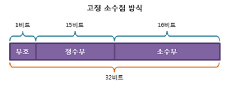
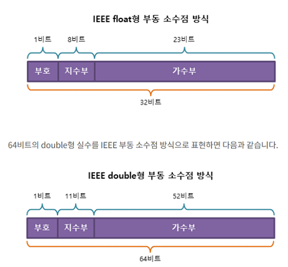
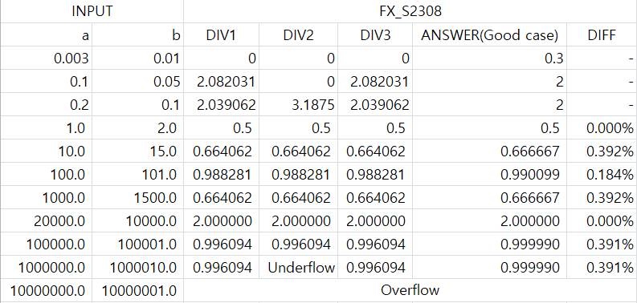
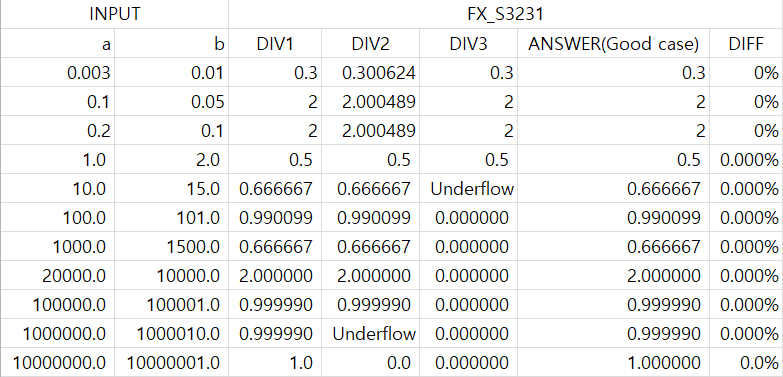
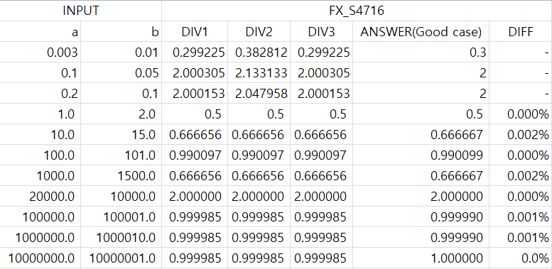
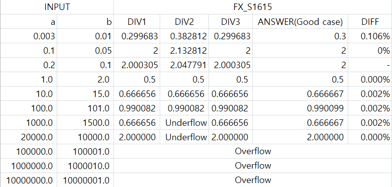
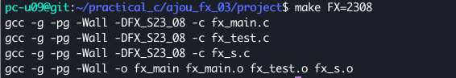

# Practical_Coding


## **고정소수점 수학 라이브러리 프로젝트** 
<br>


### **Contents**
- [**Project Description**](#%EF%B8%8Fproject-description)
    + [고정소수점 프로젝트란?](#고정소수점-프로젝트란)
    + [고정소수점 sXXYY](#고정소수점-sxxyy)
    + [sXXYY 예시 및 Max, Min, Resolution](#sxxyy-예시-및-max-min-resolution)
    + [고정소수점 종류](#고정소수점-종류)

<br>

- [**fixed point VS float point**](#%EF%B8%8Ffixed-point-vs-float-point)
    + [고정소수점이란?](#고정소수점이란)
    + [고정소수점 사용의 장점 및 단점](#고정소수점-사용의-장점-및-단점)
    + [부동소수점이란?](#부동소수점이란)
    + [부동소수점 사용의 장점 및 단점](#부동소수점-사용의-장점-및-단점)

<br>

- [**Macro**](#%EF%B8%8Fmacro)
    + [Object-like Macro](#object-like-macro)
    + [Function-like Macro](#function-like-macro)

<br>

- [**고정소수점 프로젝트에서 쓰인 Macro 및 함수**](#%EF%B8%8F%EC%95%84%EC%A3%BC-%EA%B3%A0%EC%A0%95%EC%86%8C%EC%88%98%EC%A0%90-%ED%94%84%EB%A1%9C%EC%A0%9D%ED%8A%B8%EC%97%90%EC%84%9C-%EC%93%B0%EC%9D%B8-macro-%EB%B0%8F-%ED%95%A8%EC%88%98)
    + [fixed point로 만들어주는 매크로](#fixed-point로-만들어주는-매크로)
    + [곱셈 매크로](#곱셈-매크로)
    + [단점 보완을 위한 Macro들](#단점-보완을-위한-macro들)
    + [나눗셈 함수](#나눗셈-함수)

<br>

- [**Difference**](#%EF%B8%8Fdifference)
    + [FX_S2308 Test Result](#fx_s2308-test-result)
    + [FX_S3231 Test Result](#fx_s3231-test-result)
    + [FX_S4716 Test Result](#fx_s4716-test-result)
    + [FX_S1615 Test Result](#fx_s1615-test-result)

<br>

- [**How to Compile**](#%EF%B8%8Fhow-to-compile)

<br>

## ✏️<mark>Project Description</mark>   

<br>

### **고정소수점 프로젝트란?**  

고정소수점 프로젝트는, 아주대학교의 임베디드 시스템을 위한 고정소수점 수학 라이브러리를 개발하는 프로젝트이다.   
고정소수점 프로젝트에 포함된 고정소수점 종류는 총 4가지이다.  
각 고정소수점에 대한 수학 라이브러리는 division과 multiplication이 존재한다.

<br>

### **고정소수점 sXXYY**  

고정소수점(fixed point)란, 실수를 표현하는 소수부의 자릿수를 미리 정해 놓고, 고정된 자릿수로 소수를 표현하는 것이다.   
프로젝트에서 ``sXXYY``는 sign bit(1bit), 정수부(XXbit), 소수부(YYbit)임을 의미한다.  

<br>

### **sXXYY 예시 및 Max, Min, Resolution**

``s1615``는 아래의 의미와 동일하고, 총 32bit를 사용한다.  

| sign Bit | 정수부 | 소수부 |
| ---- | ---- | ---- |
| 1 bit | 16 bits | 15 bits |

여기서 sign bit는 0 일 경우 양수이고, 1 일 경우 음수이다.  
s1615의 Max, Min, Resolution은 다음과 같다.

|  | 2진수 | 10진수 |
|----|----|---|
| Maximum | 0111 1111 1111 1111 1111 1111 1111 1111 (2) |  65535.999969482421875 (10) |
| Minimum | 1111 1111 1111 1111 1111 1111 1111 1111 (2) | -65535.999969482421875 (10) |
| Resolution | 0000 0000 0000 0000 0000 0000 0000 0001 (2) | 0.000030517578125 (10) |
<br>

### **고정소수점 종류**  

| 종류 | sign Bit | 정수부 | 소수부 | 총 bit 수 |
| ---- | ---- | ---- | ---- | ---- |
| fx_s1615| 1 bit | 16 bits | 15 bits | 32 bits |
| fx_s2308| 1 bit | 23 bits | 08 bits | 32 bits |
| fx_s3231| 1 bit | 32 bits | 31 bits | 64 bits |
| fx_s4716| 1 bit | 47 bits | 16 bits | 64 bits |
<br>

## ✏️<mark>fixed point VS float point</mark> 

<br>

### **고정소수점이란?**   

고정 소수점이란 실수를 표현하는 소수부의 자릿수를 미리 정해 놓고, 고정된 자릿수로 소수를 표현하는 것이다.  
고정소수점은 부호비트, 정수부, 소수부로 이루어져 있다.



<br>

### **고정소수점 사용의 장점 및 단점**  

고정 소수점의 장점은 크게 두 가지가 있다.   
첫 번째는 연산 효율성이 높다는 것이다. 실수 사칙연산 문제가 정수 사칙연산 문제로 바뀌기 때문에 연산에 요구되는 시스템의 자원이 줄어들게 된다.  
두 번째는 적은 수의 비트를 사용한다는 것이다.  

고정소수점 방식의 단점은 제한된 자릿수로 인해 표현할 수 있는 범위가 매우 작다는 것이다.

<br>

### **부동소수점이란?**  

부동소수점이란 하나의 실수를 가수부와 지수부로 나누어 표현하는 방식이다.  
부동소수점을 나타내는 표현 수식은 +/- 가수 × ( 10 ^ 멱지수 )이다.   
부동소수점 표현을 이진수에 적용하려면 +/- 가수 × (2 ^ 멱지수 )를 사용하면 된다.  



<br>

### **부동소수점 사용의 장점 및 단점**  

부동소수점 방식의 장점은 매우 큰 실수까지 표현할 수 있기때문에 고정 소수점 방식보다 훨씬 더 많은 범위까지 표현할 수 있다는 점이다.  
그리고 매우 크고 작은 숫자를 정확하게 나타낼 수 있다.    

부동소수점 방식의 단점은 오차가 발생할 수 있다는점이다.  

<br>

## ✏️<mark>Macro</mark> 

<br>

### **Object-like Macro**  

```c
 #define <identifier> <replacement token list>  // object
 ```

 * Object-like Macro의 형식은 위와 같으며 identifier(매크로)를 replacement token list(매크로 몸체)로 치환하는 역할을 한다. 
  * 이번 고정 소수점_Project에서는 .h파일을 이용하여 Macro를 생성하였다.

<br>

### **Function-like Macro** 
  
```c
#define <identifier>(<parameter list>) <replacement token list>  // function-like macro, note parameters
```
* Function-like Macro는 위의 형태와 같이 매개변수가 존재하는 형태의 함수와 휴사한 형식을 갖는다. 
  * BAD Examples
    ```c
	#define f(a) a*a 
	b = f(20+13) // 20 + 13 * 20 + 13 // 우선순위와 맞지 않는 결과가 나올 수 있다.

	min(, b) => (( ) < (b) ? ( ) : (b))
	min(a, ) => ((a ) < ( ) ? (a ) : ( ))
	min(,) => (( ) < ( ) ? ( ) : ( ))
	min((,),) => (((,)) < ( ) ? ((,)) : ( ))
	min() error macro "min" requires 2 arguments, but only 1 given
	min(,,) error macro "min" passed 3 arguments, but takes just 2
	
	=> 이와같이 생략해서 쓰는것 역시 좋지 않은 코드이다.
	```

<br>

## ✏️<mark>고정소수점 프로젝트에서 쓰인 Macro 및 함수</mark> 

<br>

### **fixed point로 만들어주는 매크로**  

```c
#define fromFloat(a) ((fixed) ((a)*(FX_QFLOAT_VAL)))
#define toFloat(a)   ((float) ((a)/FX_QFLOAT_VAL))
#define toDouble(a)  (((a)/FX_QFLOAT_VAL))
```

<br>

|  <center>Macro 함수</center> |  <center>기능</center> |
|:--------|:--------:|
|#define fromFloat(a) ((fixed) ((a)*(FX_QFLOAT_VAL)))|float a에 FX_QFLOAT_VAL을 곱한것을 다시 int로 type conversion을 하였다.  a에 FX_QFLOAT_VAL을 곱한것은 비트연산에서 (f*(1 << FX_QNUM)와 같다.|
|#define toFloat(a)   ((float) ((a)/FX_QFLOAT_VAL))|int a에 FX_QFLOAT_VAL을 나눈 후에 float형으로 바꾸어주고 있다.  나누어주는것은 a>>FX_QFLOAT_VAL와 같다. |
|#define toDouble(a)  (((a)/FX_QFLOAT_VAL))|위에 있는 toFloat와 같이 a를 FX_QFLOAT_VAL로 나누어주고 있다.|

<br>

### **곱셈 매크로**

* fixed point의 곱셈 함수
```c
fixed fx_mul(fixed a, fixed b)
{	
	return a * b / (1 << FX_QNUM);
}
```

위의 그림을 통해 fixed point의 곱셈 방식에 오류가 있다는것을 학인할 수 있다. 0.1*0.1을 계산 할 때 오버플로우가 나서 계산을 정확하게 하지 못한다는 단점이 있다. 

<br>

### **단점 보완을 위한 Macro들** 

```c
#define fx_mul2(a,b) (fromFloat(((toFloat(a)) * (toFloat(b)))))
#define fx_mul3(a,b) (((a)*(b))>>FX_QNUM)
#define fx_mul4(a,b) ((((long long)(a))*(long long)(b))>>FX_QNUM)
#define fx_mul5(a,b) (((a)>>FX_QNUM_HALF1)*((b)>>FX_QNUM_HALF2))
```
<br>

|  <center>Macro 함수</center> |  <center>기능</center> |
|:--------|:--------:|
|#define fx_mul2(a,b) (fromFloat(((toFloat(a)) * (toFloat(b)))))|int a,b를 모두 toFloat Macro를 통해 float형식으로 만들어준 후 그 둘의 곱을 다시 int형식으로 바꿔준다. 이 방식은 overflow를 줄일 수 있지만 시간이 많이 걸린다는 단점이 있다.|
|#define fx_mul3(a,b) (((a)*(b))>>FX_QNUM)|((a)*(b))/FX_QINT_VAL와 같이나눗셈 연산으로 한 것 보다 shift연산이 빠르기 때문에 shift연산을 사용하여 매크로를 만들었다. 다만 이 방식은 shift를 이용하였기 때문에 오버플로우가 많이 남|
|#define fx_mul4(a,b) ((((long long)(a))*(long long)(b))>>FX_QNUM)|long long conversion 할 때 시간 오래 걸릴 수 있지만 연산이 가장 잘 된다.|
|#define fx_mul5(a,b) (((a)>>FX_QNUM_HALF1)*((b)>>FX_QNUM_HALF2))|오버플로우 예방하기위해서 FX_QNUM_HALF만큼 오른쪽으로 쉬프트 하였다.|

<br>

### **나눗셈 함수** 

* div1함수
```c
fixed fx_div1(fixed a, fixed b)
{
	return fromFloat(toFloat(a) / toFloat(b));
}
```

|  <center>Macro 함수</center> |  <center>기능</center> |
|:--------|:--------:|
|div1|a,b를 float형식으로 나눈 후 다시 fixed point로 변환해주는 함수이다.|

<br>

* div2 함수
```c
fixed fx_div2(fixed a, fixed b)
{
	return (a<<FX_QNUM_HALF1) / (b>>FX_QNUM_HALF2);
}
```
|  <center>Macro 함수</center> |  <center>기능</center> |
|:--------|:--------:|
|div2|a/b를 단순히 하게 될 때 b가 a보다 크면 0이 된다. 즉 b>a일 때는 나눗셈의 의미가 없다. 하지만 (a/b)<<FX_QNUM 과 같이 계산을 한다면 오른쪽이 0으로 채워질 수 있다. 따라서 (a/b) / FX_QNUM과 같은 식인 (a<<FX_QNUM_HALF1) / (b>>FX_QNUM_HALF2)을 사용하면 된다. => (a*2^(q/2))/(b*(2^(-q/2))) = a/b*2^q 하지만 b>>FX_QNUM_HALF2에서 오차가, a<<FX_QNUM_HALF1에서 오버플로우가 발생할 수 있다. 즉 만약에 a가 2^(32-FX_QNUM_HALF1) 보다 큰 수라면 Overflow가 발생하고 b는 하위 FX_QNUM_HALF2 만큼의 데이터를 버리게 되므로 오차가 발생할 수 있다.|   

<br>

* div3 함수

```c
fixed fx_div3(fixed a, fixed b)
{
	long long la = a; 
	la <<= FX_QNUM; // fixed가 32bit면 절대로 Overflow가 생기지 않음
	la /= b;        // 이후 la를 b로 나누어주고
	return (fixed) la;  // fixed point로 바꾸어준다.
}
```
=> 이 함수는 overflow를 예발할 수 있으며 정확도 또한 높다.

<br>

## ✏️<mark>Difference</mark> 

<br>

### **FX_S2308 Test Result**  


* 소수부 비트가 적어서 작은 숫자의 연산에 불리한 모습을 보인다.

<br>

### **FX_S3231 Test Result**


* 가진 비트 수에 비해 작은 숫자들의 연산에 대해서는 안정적으로 값을 뽑아낸다.

<br>

### **FX_S4716 Test Result**


* 작은 숫자의 연산에 약간의 오차가 있다.

<br>

### **FX_S1615 Test Result**


* 비트 수가 상대적으로 적으므로 상대적으로 좁은 범위의 수에서 정확한 동작을 하는 모습을 보여준다.

<br>

## ✏️<mark>How to Compile</mark> 

<br>

make 를 하기위해 FX를 변수로 해서 값을 변화한다.
```
ex) $ make FX=2308
```




<hr>

## Lab list

<table>
  <tr>
    <td>
      <a href="https://github.com/baelanche/Practical_Coding/tree/master/lab01">Lab01</a>
    </td>
    <td>
      <a href="https://github.com/baelanche/Practical_Coding/tree/master/lab02">Lab02</a>
    </td>
    <td>
      <a href="https://github.com/baelanche/Practical_Coding/tree/master/lab03">Lab03</a>
    </td>
    <td>
      <a href="https://github.com/baelanche/Practical_Coding/tree/master/lab04">Lab04</a>
    </td>
    <td>
      <a href="https://github.com/baelanche/Practical_Coding/tree/master/lab05">Lab05</a>
    </td>
  </tr>
  <tr>
    <td>
      <a href="https://github.com/baelanche/Practical_Coding/tree/master/lab06">Lab06</a>
    </td>
    <td>
      <a href="https://github.com/baelanche/Practical_Coding/tree/master/lab07">Lab07</a>
    </td>
    <td>
      <a href="https://github.com/baelanche/Practical_Coding/tree/master/lab08">Lab08</a>
    </td>
    <td>
      <a href="https://github.com/baelanche/Practical_Coding/tree/master/lab09">Lab09</a>
    </td>
    <td>
      <a href="https://github.com/baelanche/Practical_Coding/tree/master/lab10">Lab10</a>
    </td>
  <tr>
    <td>
      <a href="https://github.com/baelanche/Practical_Coding/tree/master/lab11">Lab11</a>
    </td>
    <td>
      <a href="https://github.com/baelanche/Practical_Coding/tree/master/lab12">Lab12</a>
    </td>
    <td>
      <a href="https://github.com/baelanche/Practical_Coding/tree/master/lab13">Lab13</a>
    </td>
  </tr>
</table>
