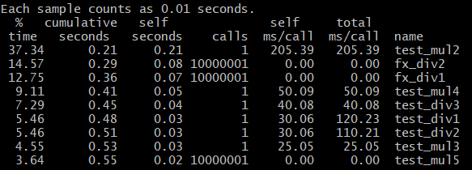

# lab09
* compile

## compile
* cc -pg [file] : gmon.out 파일이 생성되면서 a.out을 프로파일링 할 수 있게 된다
* gprof [file] [gmon.out] : [file] 이 프로파일링 된 결과가 출력된다

### Flat profile
* 함수 별 자원을 출력해준다


```
%time : 함수의 CPU사용률
cumulative seconds : 실행 시간
self seconds : 함수 내의 실행 시간
calls : 함수 호출 횟수
self ms/call : 함수 호출당 self ms
total ms/call : 함수 호출당 total ms
```
